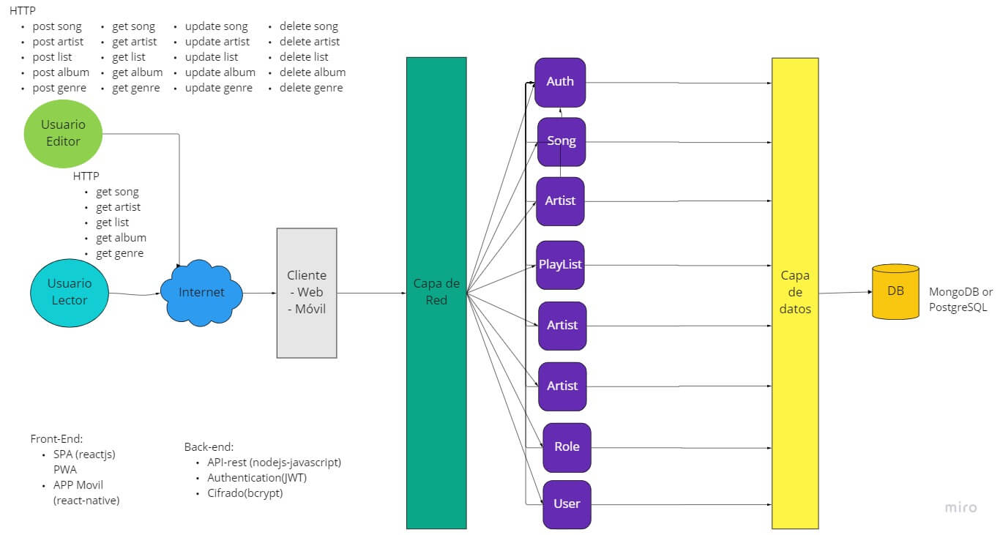
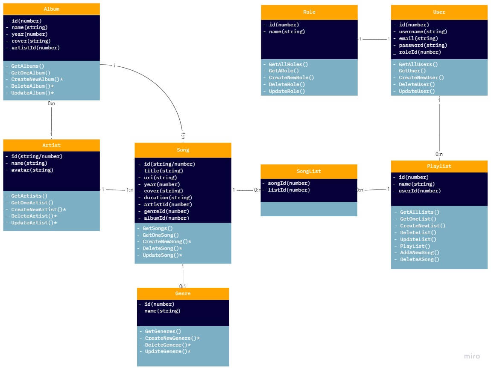

# SpotPlay

## Indice

- [Definición y Acronimos](#definición-y-acronimos)
- [Visión General](#visión-general)
- [Alcance](#alcance)
- [Casos de Uso](#casos-de-uso)
- [Casos No Soportados](#casos-no-soportados)
- [Arquitectura](#arquitectura)
  - [Diagramas](#diagramas)
  - [Modelo de Datos](#modelo-de-datos)
- [Limitaciones](#limitaciones)
- [Costo](#costo)

## Definición y Acronimos

- API: Application Programming Interface, en este contexto, una interface accesible via protocolo HTTP para obtener recursos via endpoints (URIs) para obtener algun recurso.
- Router: Enrutador, encargado de direccionar una petición.
- Controlador: Encargado de suministar los recursos solicitados accesando a la base de datos.
- BD: Base de datos.
- Backend: Responsable de almacenar y manipular los datos, es la parte de la aplicación que no es accesible para un cliente.
- Frontend: Parte de la aplicación que interactua con los usuarios, como una pagina web o una app movil.
- JWT: JSON Web Token, mecanismo para intercambio de información entre un cliente y un servidor a través de token que identifica al cliente.

## Visión General

SpotPlay es una nueva compañía de música online que tiene como objetivo proporcionar mejores relaciones con los artistas y fans. 

Su producto es _SpotPlay_, una plataforma en la que las personas pueden generar  listas de reproducción para sus artistas favoritos y gustos musicales. 

### Alcance

- La aplicación estará dividida en backend y frontend.
- El front en podrá recibir solicitudes HTTP y devolver infromación en formato JSON.
- Las solicitudes realizadas al backend sólo se atenderán utilizando un mecanismo de JWT.
- Los usuarios solo podran interactuar con la aplicación si estan registrados y logeados.
- La aplicación permitirá el registro de dos tipos de usuarios para escuchar música: consumidores y editores.
- Los usuarios consumidores sólo tendrán permisos de lectura sobre autores y los archivos de música, aunque podrán crear sus propias listas.
- Los usuarios editores tendrán permisos para crear y editar autores, archivos de música y sobre sus propias listas.

#### Casos de Uso

* Los usuarios podrán logearse a través de nombre de usuario y contraseña.
* Los usuarios podrán registrase para poder accesder a los servicios de SpotPlay.
* Al momentó de registrarse, un usuario podrá escoger si desea ser usuario lector o usuario editor para colaborar con la administración de la aplicación.
* Un usuario lector/consumidor solo podrá crear y administrar sus listas de resproducción.
* Un usuario editor tendrá la oportunidad de manejar no solamente sus listas, sino tambien colaborar para agregar música y su infromación asociada como autores, albums y generos demúsica.

#### Casos No Soportados

* El usuario no puede acceder con cuentas de terceros como Google, Facebook, etc.

## Arquitectura

La arquitectura propuesta es cliente-servidor, donde los clientes podrán usar un navegador para acceder a los servicios de SpotPlay. SpotPlay estará dividido en dos aplicaciones: Backend y Frontend, el Backend brindará los servicios desde los cuales el Frontend en formato web o movile app podran acceder.

Internamente el backend estará dividido en modulos que manejaran el acceso a los recursos, por ejemplo un modulo para manejar los usuarios, un modulo para manejar las canciones, un modulo para manejar las listas, etc.

### Diagramas

El siguiente diagrama ilustra la arquitectura interna del backend.

### Modelo de Datos

Se muestra a continuación la asociación de datos.

### Diseño API-Rest

| Dominio | Enpoint | Verbo | Descripción | Datos de entrada | Datos de salida |
|---------|---------|-------|-------------|------------------|-----------------|
| localhost:5000/api/v1 | /singup | POST | Crear datos de un usuario | Username, password, email, role | Mensasje de éxito |
| localhost:5000/api/v1 | /user | GET | Obtener datos de usuarios |  | Lista de usuarios |
| localhost:5000/api/v1 | /user:id | PUT/PATCH | Actualizar un usuario | Id de usuario, Username, password, email, role | Mensasje de exito |
| localhost:5000/api/v1 | /user:id | DELETE | Eliminar usuario | Id de usuario | Mensasje de exito |
| localhost:5000/api/v1 | /user:id | GET | Obtener datos de un usuario | Id de usuario  | Datos del usuario |
| localhost:5000/api/v1 | /song | POST | Crear datos de una nueva canción | Titulo, uri, duracion, año, imagen, idArtista, idGenero, idAlbum | Mensasje de éxito |
| localhost:5000/api/v1 | /song | GET | Obtener datos todas las canciones |  | Lista de canciones |
| localhost:5000/api/v1 | /song:id | PUT/PATCH | Actualizar una canción | Id de canción, Titulo, uri, duracion, año, imagen, idArtista, idGenero, idAlbum | Mensasje de éxito |
| localhost:5000/api/v1 | /song:id | DELETE | Eliminar una canción | Id de canción | Mensasje de exito |
| localhost:5000/api/v1 | /song:id | GET | Obtener datos de una canción | Id de canción  | Datos de la canción |
| localhost:5000/api/v1 | /artist | POST | Crear datos de nuevo artista | Nombre, avatar | Mensasje de exito |
| localhost:5000/api/v1 | /artist | GET | Obtener datos de un artista |  | Lista de artistas |
| localhost:5000/api/v1 | /artist:id | PUT/PATCH | Actualizar un artista | Id de artista, Nombre, avatar | Mensasje de exito |
| localhost:5000/api/v1 | /artist:id | DELETE | Eliminar artista | Id de artista | Mensasje de exito |
| localhost:5000/api/v1 | /artist:id | GET | Obtener datos de un artista | Id de artista | Datos del artista |
| localhost:5000/api/v1 | /album | POST | Crear datos de un nuevo album | Nombre, años, cover, artistId | Mensasje de exito |
| localhost:5000/api/v1 | /album | GET | Obtener datos de todos los albums |  | Lista de albums |
| localhost:5000/api/v1 | /album:id | PUT/PATCH | Actualizar un album | Id, Nombre, años, cover, artistId | Mensasje de exito |
| localhost:5000/api/v1 | /album:id | DELETE | Eliminar album | Id de album | Mensasje de exito |
| localhost:5000/api/v1 | /album:id | GET | Obtener datos de un album | Id de album | Datos del album |
| localhost:5000/api/v1 | /genre | POST | Crear datos de un género musical | Nombre | Mensasje de exito |
| localhost:5000/api/v1 | /genre | GET | Obtener datos de un género musical |  | Lista de géneros musicales  |
| localhost:5000/api/v1 | /genre:id | PUT/PATCH | Actualizar un género musical | Id, Nombre | Mensasje de exito |
| localhost:5000/api/v1 | /genre:id | DELETE | Eliminar un género musical | Id del género | Mensasje de exito |
| localhost:5000/api/v1 | /genre:id | GET | Obtener dsatos de un un género musical | Id del género | Datos del un género musical |
| localhost:5000/api/v1 | /list | POST | Crear una nueva lista | Id, nombre, userId | Mensasje de exito |
| localhost:5000/api/v1 | /list | GET | Obtener todas las listas |  | Lista de usuarios |
| localhost:5000/api/v1 | /list:id | PUT/PATCH | Actualizar una lista |Id, nombre, userId | Mensasje de exito |
| localhost:5000/api/v1 | /list:id | DELETE | Eliminar una lista |  | Mensasje de exito |
| localhost:5000/api/v1 | /list:id | GET | Obtener dsatos de una lista |  | Datos del usuario |
| localhost:5000/api/v1 | /list:id/addsong:id/ | POST | Agragar una canción a una lista | Id de lista, Id de canción | Mensasje de exito |
| localhost:5000/api/v1 | /auth | POST | Crear nueva sesión (login) | Username o email, password | Mensasje de exito |
| localhost:5000/api/v1 | /auth:id | DELETE | Eliminar sesión (log-out) |  | Mensasje de exito |

## Limitaciones

* Llamadas del API podria tener cierta latencia debido a que es un servidor con propositos de prueba
* Es posible que el servidor soporte limitada cantidad de conexiones simultaneas
